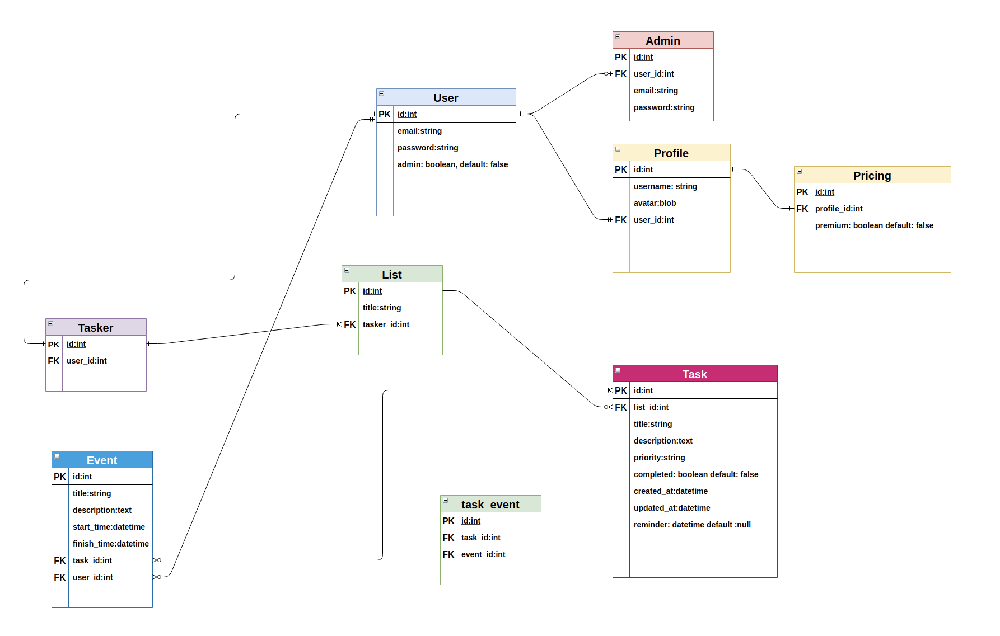
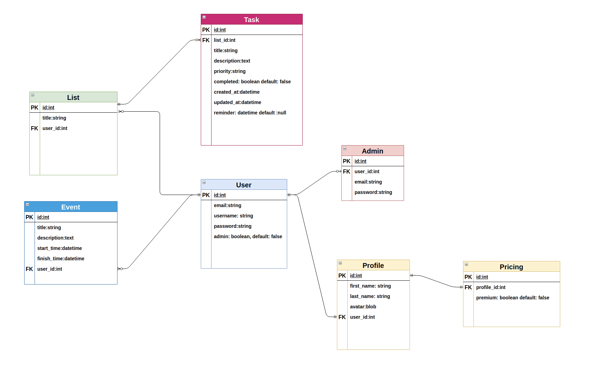
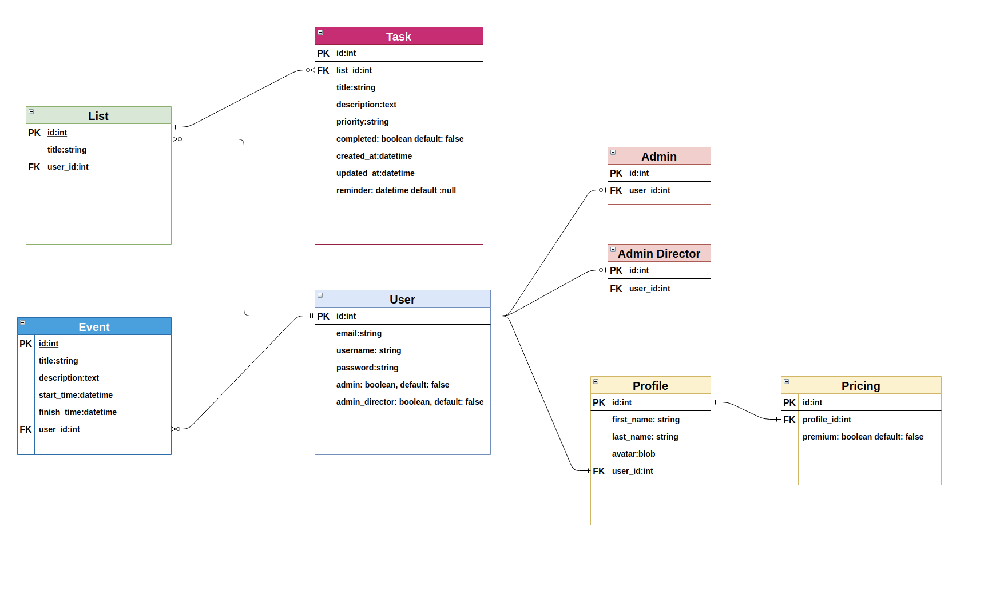

# README

This README would normally document whatever steps are necessary to get the
application up and running.

Things you may want to cover:

## ERD

- Ruby version

- System dependencies

- Configuration

- Database creation

- Database initialization

- How to run the test suite

- Services (job queues, cache servers, search engines, etc.)

- Deployment instructions

- ...

## To_Do_List

- BE TEsting -> me ---.> quicker
- FE Testing -> RAy ->>>> together
- CYpress???? -> BOth -> 5

- 1 full test of the site edge - BOth

- PUSH main -> BOth rep

- DEPlyments -> BOth

- 1 full test of the site edge - BOth -> 2 friends take notes

- TRellow UPDATE -> Ray

- DOCS -> Me
