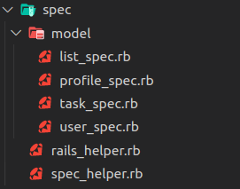
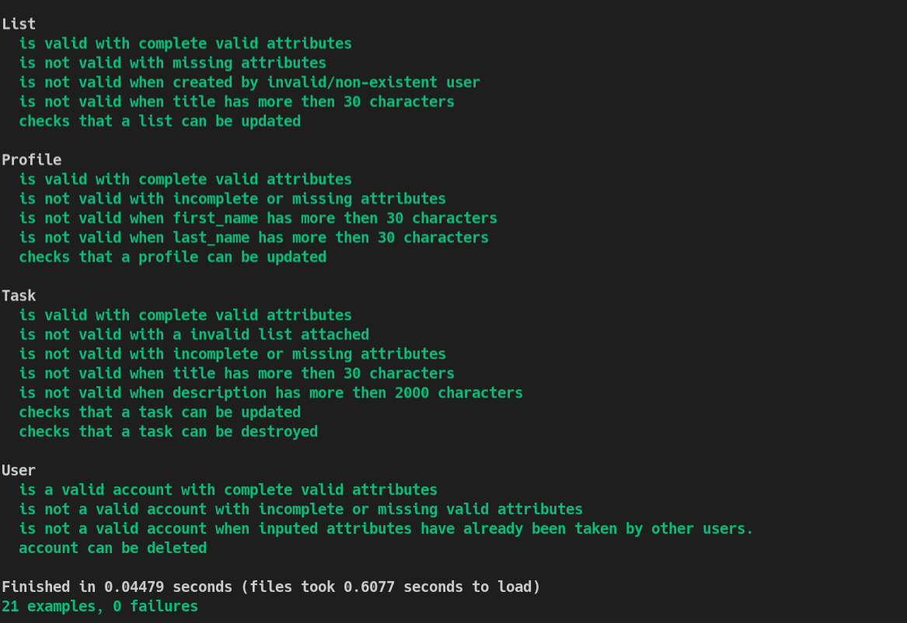
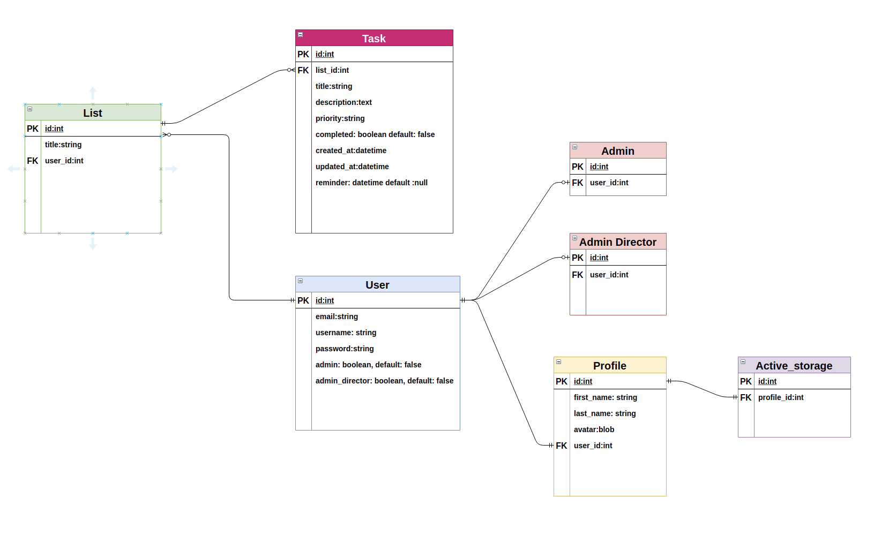

# Untitled-Suite

**The Schwifty Committee Repo / Source Code:**

[Link to the Organisation Repo](https://github.com/TheSchwiftyCommittee/untitled-suite)

**Front-End Repo:**

[Link to Front-End GitHub Repo](https://github.com/TheSchwiftyCommittee/untitled-suite-react-app)

**Back-End Repo:**

[Link to Back-End GitHub Repo](https://github.com/TheSchwiftyCommittee/untitled-suite-api-db)

Built by:

- Nathan Blaga [GitHub](https://github.com/NJBLAGA)
- Raymond Doan [GitHub](https://github.com/raymonddoan)

## **Instructions**

Follow the below steps to successfully install and run Prince Theatre.

1. Head over to the project's back-end GitHub page at `https://github.com/TheSchwiftyCommittee/untitled-suite-api-db`
1. Click on the green button labelled `code`
1. Copy either the `HTTPS` or `SSH link`.
1. In your terminal, head to the directory/folder of your choice (where you want to store the backend)
1. Type the following command `git clone xxxxxxxxxxxxx` (xxxx denoting the copied link from step 3)
1. This command will then proceed to clone the back-end repo to your local machine
1. Navigate to your local cloned copy by using `cd untitled-suite-api-db` in your terminal
1. Using `bundle install`, install the projects required dependencies'
1. Once the above command has finished, open the project using the command `code.` (if using `VS Code`) or the text editor of your choice

## **Setting up the Database**

Once the previous steps have been completed, it is time to set up your database. Navigate to your terminal and run the following line:

```r
# Creates a database for project
rails db:create
```

Once the database has been created, run the following line:

```r
# Runs migrations for the current environment that has not yet been run.
rails db:migrate
```

An optional step is to populate the database with pre made admins, users, lists ,and tasks, using the `seeds.rb` file. To do so, run the following command:

```r
# Seeds your database with pre made admins, users and listings.
rails db:seed
```

Once successfully completed, `Untitled-Suite's` database should be established and seeded, ready to run.

## **Active Storage/Cloudinary**

**_NOTE:_** If you wish to run another service such as `AWS` rather than `Cloudinary`, feel free to do so, however out of the box `Untitled-Suite` is already setup to utilise `Cloudinary` and `active storage`.

To set up this feature, open the project in a text editor. Once open, navigate to the `config` folder and delete the file named `credentials.yml.enc`

Now you can create your own by typing the following command in your terminal:

```r
EDITOR="code --wait" rails credentials:edit
```

This will open up a new credentials file, input the following:

```r
cloudinary:
  service: Cloudinary
  cloud_name: xxxxxxxxxxx
  api_key: xxxxxxxxxxxxxxxxx
  api_secret: xxxxxxxxxxxxxxxxxx
```

**_NOTE:_** You can find your `cloud_name`, `api_key` and `api_secret` on your cloudinary dashboard. If you do not have an account, create one here:

**http://www.cloudinary.com**

Once you have signed up (it is for free), you will be directed to your `dashboard`.

Once you have entered your credentials in the same way shown above, save and close the file. The following will be displayed:

```r
File encrypted and saved.
```

Now navigate to the file named `storage.yml` in the `config` folder and confirm the following lines of code are present:

```r
cloudinary:
  service: Cloudinary
  cloud_name: <%= Rails.application.credentials.dig(:cloudinary, :cloud_name) %>
  api_key: <%= Rails.application.credentials.dig(:cloudinary, :api_key) %>
  api_secret: <%= Rails.application.credentials.dig(:cloudinary, :api_secret) %>
```

Last step is to navigate to the `environments` folder within the `config` folder of your project. There you will see two files named; `development.rb` and `production.rb`

Out of the box, both are configured to store uploaded files on `Cloudinary` rather than locally. **_(No action is needed unless you wish to have files stored locally.)_**

All configuration needed to run `Untitled-Suite` alongside `Cloudinary` should now be completed and ready to run.

In your terminal, type the following command:

```r
#Runs rails server on port 4000(default)
rails s -p 4000
```

The `API back-end` should now be running on `localhost:4000`.

Enjoy!

## **How to Run tests**

1. All `Untitled-Suite` testing files are located withing the `/spec/model` folders as shown below:



1. Using `bundle install` as instructed above, all of the projects required `dependencies` and `gems` will be installed -- including the gem `rspec-rails`.
1. Within a terminal run either of the following commands `rspec spec` or `rspec spec --format documentation` from the root directory of cloned your project.
1. Rspec will then display the following in your terminal:



## **ERD**

Throughout `Untitled-Suite's` API development, several key aspects were altered and changed based on the changing state of the application's `MVP`. The `ERD` of `Untitled-Suite` will continue to change and alter as new features are development and implemented.

## **Version 1:**


## **Version 2:**


## **Version 3:**


## **Version 4:**


